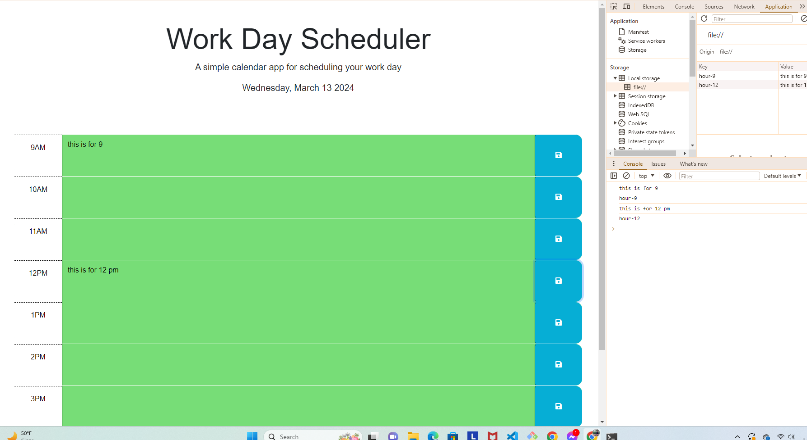

# WORK-DAY-SCHEDULER-CHALLENGE
* This applications contains a 9:AM-5PM timeblock for the current day which is displayed on top of the page.
* The time blocks are color-coded indicating that corresponding time is in the past, present, or future.
* User will be able to enter and save events for each time block.
* The saved events stays on the page even after refreshing.
This is the URL for the deployed application:
https://jenina52112.github.io/WORK-DAY-SCHEDULER-CHALLENGE/

